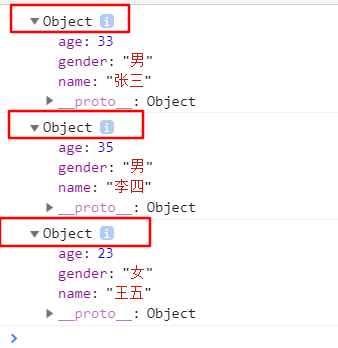

# this关键字

解析器在调用函数每次都会向函数内部传递进一个隐含的参数,这个隐含的参数就是this。
this指向的是一个对象，这个对象我们称为函数执行的`上下文对象`。

#### 根据函数的调用方式的不同，this会指向不同的对象

* 1.以函数的形式调用时，this永远都是window

```javascript
function func(){
	console.log(this) //返回window
}

func()
```

* 2.以方法的形式调用时，this就是调用方法的那个对象

```javascript

function fun(){
    console.log(this.name);
}
			
var obj = {
    name:"孙悟空",
    sayName:fun
};
			
var obj2 = {
     name:"沙和尚",
     sayName:fun
};
			
console.log(obj.sayName == fun);
			
var name = "全局的name属性";
			
//以函数形式调用，this是window
fun();
			
//以方法的形式调用，this是调用方法的对象
obj.sayName();
obj2.sayName();

```

# 工厂方法

通常在函数中封装一个对象的生成,通过该函数可以大批量的创建对象,我们成为使用工厂方法创建对象。

```javascript
function NewPerson(_name,_age,_gender){
	var obj = {
		name:_name,
		age:_age,
		gender:_gender
	}
	//以上代码等同于
	/*
	var obj = new Object() //Object()是一个Object类的构造函数
	obj.name = _name
	obj.age = _age
	obj.gender = _gender
	*/
	return obj
}

var zs = NewPerson("张三",33,"男")
var ls = NewPerson("李四",35,"男")
var ww = NewPerson("王五",23,"女")

console.log(zs)
console.log(ls)
console.log(ww)
```

以上代码生成了不同的对象,但你会发觉他们所有实例都来自Object这个类,Object()实际上Object类的函数。



而NewPerson()函数的调用就可以生成一个Object类的实例对象。`new Object()`在JS中其实是另一种调用各函数的方式,称为调用构造函数。

我们自己定义一个`demo`函数如下：

```javascript
function Demo(){
	console.log("this is a demo")
}

Demo(); //第1种方式：普通调用

var obj = {
     name:"printer",
     demo:Demo
}

obj.demo(); //第1种方式：方法调用

var d = new Demo(); //第3种方式：构造函数调用

console.log(d) //返回demo类的实例

```

# 构造函数

构造函数就是一个普通的函数，创建方式和普通函数没有区别,不同的是构造函数习惯上首字母大写,构造函数和普通函数的区别就是调用方式的不同,普通函数是直接调用，而构造函数需要使用new关键字来调用。

创建一个构造函数，专门用来创建Person对象的,构造函数的执行流程：

* 1.把函数名看成一个类,并且立刻创建一个新的对象
* 2.将新建的对象设置为函数中this,在构造函数中可以使用this来引用新建的对象
* 3.逐行执行函数中的代码
* 4.将新建的对象实例作为返回值返回

```javascript

//如果我们使用new关键字调用如下函数,那么函数名Person我们就可以看成一个类
function Person(_name,_age,_gender){
    this.name = _name
    this.age = _age
    this.gender = _gender
    this.getInfo = function(){
	console.log("----------信息如下---------------")
	console.log("name=",this.name)
	console.log("age=",this.age)
	console.log("gender=",this.gender)
    }
}

var zs = new Person("张三",33,"男")
var ls = new Person("李四",35,"男")
var ww = new Person("王五",23,"女")

console.log(zs)
console.log(ls)
console.log(ww)

zs.getInfo()

```

使用构造函数得到的对象实例均来自于Person类


#### 使用instanceof可以检查一个对象是否是一个类的实例
语法：对象 instanceof 构造函数

* 如果是，则返回true，否则返回false

```javascript
console.log(per instanceof Person);
console.log(dog instanceof Person);
```			

所有的对象都是Object的后代，所以任何对象和Object做instanceof检查时都会返回true

```javascript
console.log(dog instanceof Object);
```
